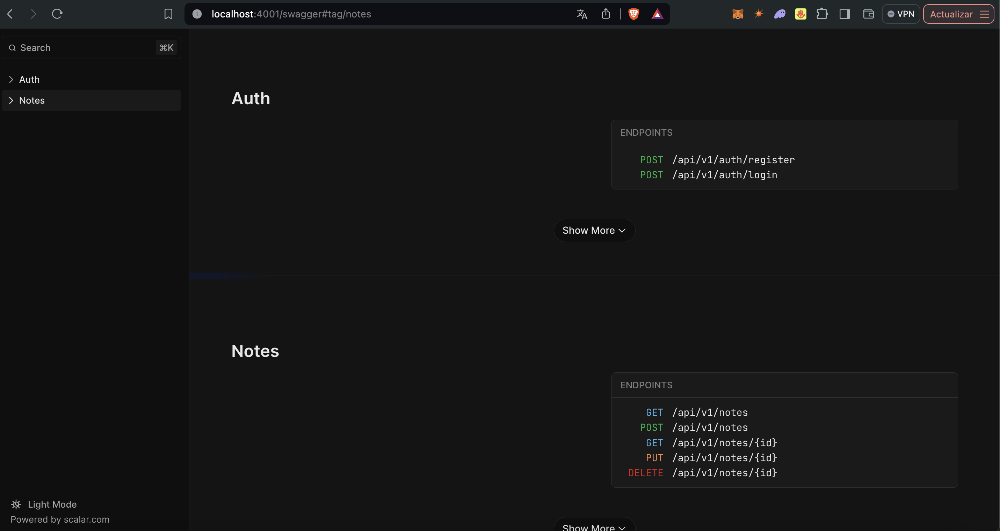

# 🦊 Bun + Elysia + Postgres.js Clean Architecture Example

A clean architecture implementation using [Bun](https://bun.sh/), [Elysia](https://elysiajs.com/), and [Postgres.js](https://github.com/porsager/postgres) for building a robust and scalable API.

## 🚀 TLDR

- **Lightning Fast**: Incredibly quick app startup and blazingly fast test execution.
- **Debugger Ready**: Configure and run the "Debug Bun" setup in `src/app.ts` or any test file for seamless debugging.
- **Swagger Integration**: Impressive API documentation with built-in type safety.
- **Clean Architecture**: While not out-of-the-box, this boilerplate demonstrates how to achieve a scalable clean architecture with Elysia.
- **Plugin System**: Easily extensible through Elysia's plugin system, as showcased in this repo.
- **Open Source Boilerplate**: Designed to kickstart your projects with best practices baked in.

This project aims to provide a solid foundation for building real-world applications with Bun and Elysia, emphasizing the importance of testing, debugging, and maintainable architecture.

## 🚀 Roadmap

- [x] Bun as runtime
- [x] Elysia as web framework
- [x] Postgres.js for database operations
- [x] Clean Architecture pattern
- [x] ESLint + Prettier configuration
- [x] Organized import sorting
- [x] Environment variable management
- [x] Simple database migration
- [x] Integration (E2E) tests
- [x] Swagger documentation
- [ ] Test database setup
- [ ] JWT Guard implementation
- [ ] Caching mechanism
- [ ] Enhanced logging
- [ ] OpenTelemetry integration
- [ ] Improved database migrations

## 📚 Table of Contents

- [Overview](#overview)
- [Project Structure](#project-structure)
- [Setup](#setup)
- [Features](#features)
- [API Documentation](#api-documentation)
- [Testing](#testing)
- [TODO](#todo)
- [Contributing](#contributing)
- [License](#license)

## 🌟 Overview

This project demonstrates a clean architecture approach to building a web API using modern JavaScript technologies. It leverages [Bun](https://bun.sh/) as the runtime environment, [Elysia](https://elysiajs.com/) as the web framework, and [Postgres.js](https://github.com/porsager/postgres) for database interactions. The application follows clean architecture principles, ensuring a clear separation of concerns and maintainability.

Key highlights:
- Extremely fast startup times and test execution
- Integrated debugging capabilities
- Comprehensive Swagger documentation with strong typing
- Scalable architecture achieved through careful structuring and Elysia's plugin system

While Elysia doesn't provide a scalable structure out of the box, this boilerplate shows how to achieve clean architecture with some additional effort, making it an excellent starting point for serious application development.

## 🏗 Project Structure

The project follows a clean architecture pattern with the following structure:

```
src/
├── auth/
│   ├── application/
│   ├── domain/
│   └── infrastructure/
├── notes/
│   ├── application/
│   ├── domain/
│   └── infrastructure/
├── shared/
│   └── infrastructure/
└── users/
    ├── domain/
    └── infrastructure/
```

- `auth/`: Authentication-related modules
- `notes/`: Note management modules
- `users/`: User management modules
- `shared/`: Shared utilities and configurations

Each module is divided into:
- `application/`: Use cases and business logic
- `domain/`: Domain entities and types
- `infrastructure/`: External interfaces (controllers, repositories)

## 🛠 Setup

1. Clone the repository
2. Install dependencies:
   ```
   bun install
   ```
3. Set up environment variables (copy `.env.example` to `.env` and fill in the values)
4. Start the database:
   ```
   bun run db:up
   ```
5. Run database migrations:
   ```
   bun run db:migrate
   ```
6. Start the development server:
   ```
   bun run dev
   ```

## ✨ Features

### 🌐 Elysia Web Framework
The project uses Elysia, a modern and performant web framework for Bun. It provides a clean and intuitive API for building web applications.

### 🗄️ Postgres.js
[Fastest full-featured node & deno client](https://github.com/porsager/postgres-benchmarks#results), Postgres.js is used for database operations, offering a simple and efficient way to interact with PostgreSQL databases.

### 🏛 Clean Architecture
The project follows clean architecture principles, separating concerns into distinct layers: Application, Domain, and Infrastructure.

### 🧹 ESLint + Prettier
Code quality and consistency are maintained using ESLint and Prettier with a standardized configuration.

### 📁 Import Sorting
Imports are automatically organized using the `eslint-plugin-simple-import-sort` plugin.

### 🔐 Environment Management
Environment variables are managed securely using a combination of `.env` files and the `zod` library for validation.

### 🗃 Database Migration
A simple database migration system is implemented using raw SQL scripts.

### 📚 Swagger Documentation
API documentation is automatically generated using Swagger, making it easy for developers to understand and interact with the API.

## 📖 API Documentation

The API documentation is available through Swagger UI. After starting the server, you can access it at `http://localhost:3000/swagger`.

Here's a preview of what the Swagger documentation looks like:



## 🧪 Testing

The project includes integration (E2E) tests to ensure the correct functionality of the API endpoints. Run the tests using:

```
bun test
```

## 📝 TODO

- [ ] Set up a separate test database that can be dynamically created and destroyed for each test run
- [ ] Implement JWT Guard for protected routes
- [ ] Add caching mechanism to improve performance
- [ ] Enhance logging capabilities for better debugging and monitoring
- [ ] Integrate OpenTelemetry for advanced observability
- [ ] Improve database migration system for better version control and rollback capabilities
- [ ] Implement rate limiting for API endpoints
- [ ] Add input validation middleware
- [ ] Set up CI/CD pipeline
- [ ] Implement refresh token mechanism
- [ ] Add WebSocket support for real-time features

## 🤝 Contributing

Contributions are welcome! Please feel free to submit a Pull Request.

## 📄 License

This project is licensed under the MIT License - see the [LICENSE](LICENSE) file for details.


[El contenido existente se mantiene...]


[El resto del contenido existente se mantiene...]